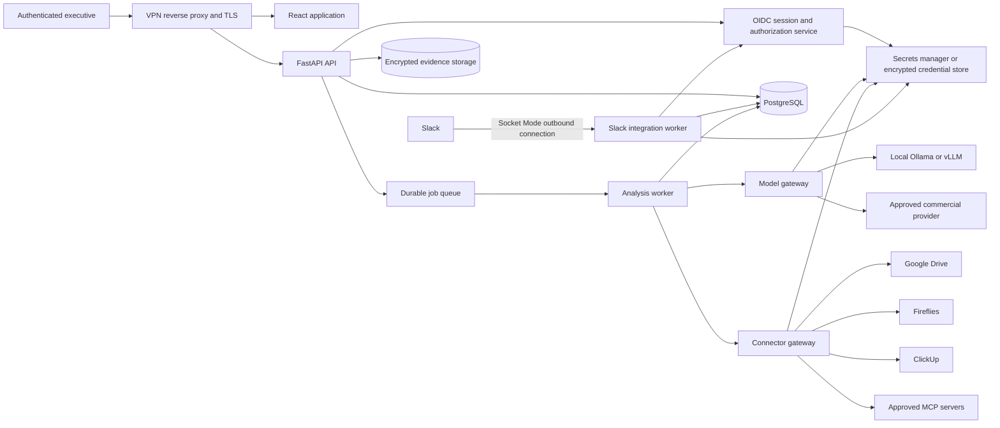

# Workplace Product Roadmap

## AI Swarm Analysis for strategy and investment decisions

- **Status:** Proposed implementation roadmap
- **Prepared:** 2026-07-20
- **Target environment:** Internal, on-premise, VPN-accessible service
- **Primary users:** C-level executives and Directors
- **Planning unit:** AI engineering hours
- **Roadmap style:** Outcome-based releases plus implementation-ready product and technical backlog

---

## 1. Executive direction

Evolve AI Swarm Analysis into an internal **decision intelligence service** where leaders can frame a strategy or investment decision, assemble relevant internal evidence, obtain a multi-perspective debate, and share an attributable recommendation while preserving material disagreement and confidentiality.

The first productive release should optimize this workflow:

1. A logged-in executive starts from a strategy or investment template.
2. The executive defines the options, constraints, investment horizon, assumptions, and success criteria.
3. The executive adds selected evidence from Google Drive, Fireflies, ClickUp, an approved MCP server, or a direct API connector.
4. The service creates an independent expert panel, optional rebuttal round, stress test, and evidence-linked synthesis.
5. The debate remains private or becomes visible to authenticated colleagues inside the organization.
6. The creator shares a permission-aware link or Slack summary.
7. Readers submit positive or negative feedback on the outcome.
8. Product analytics measure activation, repeat use, sharing, and reported helpfulness through a metadata-only event schema.

### Product boundary

The service scope is analysis, debate, evidence, and sharing.

### Assumptions to validate during implementation

- **Public debate** means readable by every active, authenticated user in this deployment.
- **Private debate** means readable by its creator and users or groups with whom it has been explicitly shared.
- The creator can switch a debate between private and public and remains permanently identified in its history.
- Google Workspace accounts are the identity source; the deployment uses one or more administrator-approved email domains.
- The on-premise network can make controlled outbound connections to Google, Slack, approved model providers, and approved connectors.
- External connectors are read-only in the first release.
- Initial capacity objective: 100 registered users, 25 simultaneously active users, and 10 concurrently running debates.
- Default evidence retention is 90 days and debate retention is indefinite until an administrator chooses a policy.

---

## 2. Current product baseline

The repository already provides a working local decision-analysis application:

- Three to five independently generated expert lenses.
- Optional expert rebuttals.
- Clarifying questions before role planning.
- Devil's-advocate stress testing and conflict-preserving synthesis.
- Live stage updates over Server-Sent Events.
- Reusable role library and model selection.
- Session history and Markdown export.
- OpenAI-compatible model-provider client.
- Backend, frontend, and end-to-end automated tests.

The current architecture was designed for a trusted, local, single-user process. The workplace service therefore needs a deliberate service foundation before collaboration and integrations are enabled.

| Current capability | Workplace gap | Required evolution |
| --- | --- | --- |
| In-memory runs | Run lifetime matches the current backend process | PostgreSQL persistence, migrations, durable run events, interruption recovery |
| JSON-file role library | Global mutable settings with single-process assumptions | Database-backed organization settings with administrator-only writes |
| Open API routes | Any network client can read or mutate all runs and settings | Google sign-in, server sessions, authorization on every object and function |
| Global provider environment variables | One key/model for all users and no visible egress policy | Encrypted BYOK profiles, commercial/local routing, classification policy, usage controls |
| Session history | No creator, visibility, search, or sharing model | Debate entity, creator attribution, private/public ACLs, user/group shares |
| Free-form decision prompt | Inconsistent context for strategy and investment analysis | Structured decision brief and reusable executive templates |
| Model-only synthesis | No auditable connection between sources and claims | Evidence snapshots, source identifiers, citations, unsupported-claim warnings |
| Markdown download | Sharing depends on file exchange | Authenticated links, Slack share, permission-aware unfurls |
| Unmeasured helpfulness | Product value is implicit | Per-user positive/negative feedback plus reason categories |
| Direct asynchronous tasks | Work is tied to the API process | Persistent job state, worker execution, cancellation/retry, concurrency controls |

Repository evidence: [README](../README.md), [FastAPI routes](../backend/app/main.py), [run models](../backend/app/models.py), [in-memory store](../backend/app/store.py), [provider client](../backend/app/client.py), and [original design specification](../outputs/ai-swarm-framework-spec.md).

---

## 3. Product principles

1. **Evidence before eloquence.** Each consequential recommendation should expose its supporting evidence, assumptions, and unknowns.
2. **Private by default.** New debates start private. Visibility changes are explicit and audited.
3. **Identity at every boundary.** VPN location is one signal; every application request still requires authentication and authorization.
4. **Attributable decisions.** The debate creator, creation time, visibility history, evidence sources, selected model profile, and run lineage remain visible.
5. **Controlled egress.** Before a run begins, the user can see whether confidential content will go to a local or external model and which external sources will be contacted.
6. **Read-only intelligence first.** Connectors retrieve user-selected evidence. External-system changes remain behind separately permissioned, user-confirmed actions in a later release.
7. **Disagreement remains useful.** Outputs distinguish consensus, competing recommendations, assumptions, and reversal conditions.
8. **Fast executive consumption.** The first screen of a completed debate delivers a decision-ready summary, with detail available below it.
9. **Metadata-only measurement.** Adoption analytics contain event metadata and performance data, with decision content excluded by schema.

---

## 4. Target product experience

### 4.1 Strategy and investment decision brief

Replace the single text box with a progressive form while retaining an optional free-form mode.

Required fields:

- Decision question.
- Decision type.
- Options being compared.
- Strategic objective.
- Constraints and non-negotiables.
- Time horizon.
- Success criteria.

Optional investment fields:

- Investment amount and currency.
- Opportunity cost.
- Downside limit.
- Reversibility.
- Risk appetite.
- Assumptions already believed by the creator.
- Unknowns that could change the decision.

Initial templates:

- Market entry.
- Capital allocation.
- Build, buy, or partner.
- Acquisition or strategic partnership.
- Product or portfolio investment.
- Vendor or platform commitment.

Each template changes the clarification questions, suggested expert lenses, and synthesis format while preserving the orchestration security boundary.

### 4.2 Evidence pack

The creator selects evidence before starting the debate:

- Google Drive files through a file picker.
- Fireflies meeting transcripts.
- ClickUp tasks or project lists.
- Approved MCP resources or tools.
- Uploaded text, Markdown, PDF, CSV, or office documents.
- Manually entered facts or assumptions.

Every evidence item records:

- Source type, source title, source URL or opaque external identifier.
- Who attached it and when.
- Retrieval time and content hash.
- Access scope used for retrieval.
- A text snapshot or securely stored file snapshot for reproducibility.
- Classification and retention date.
- Whether retrieval is still authorized.

Evidence is serialized as untrusted data. System instructions, tool authorization, and debate access are enforced by application code outside the model.

### 4.3 Executive synthesis

The top of a completed debate should contain:

1. Recommendation in two to four sentences.
2. Options comparison matrix.
3. Expected upside and principal downside.
4. Assumptions that carry the recommendation.
5. Evidence references supporting major claims.
6. Material disagreement among experts.
7. Conditions that would reverse the recommendation.
8. Remaining unknowns and the next information worth obtaining.
9. Confidence expressed as a calibrated label with an explanation, rather than a decorative percentage.

The detailed expert analyses, rebuttals, devil's advocate, and full synthesis remain available below the executive view.

### 4.4 Decision room and sharing

- Every debate displays its creator's name and avatar.
- A new debate is private.
- The creator can share with one or more users or Google-derived groups.
- Share roles are `viewer` and `participant`; both may read, while a participant may launch a new run or fork with additional context.
- The creator can make a debate public to all authenticated users.
- A stable, opaque URL opens the debate after authentication.
- Inaccessible debate identifiers return a non-enumerating response.
- Sharing changes are appended to the audit log.
- A public/private badge appears in lists, pages, Slack messages, and exports.
- Search and filters cover title, creator, decision type, visibility, model, and creation date; content search is deferred until its authorization design is verified.

### 4.5 Feedback

Readers can submit one current rating per completed run:

- Positive or negative.
- Optional reason: `well_supported`, `surfaced_new_risk`, `clear_recommendation`, `missing_context`, `weak_evidence`, `too_generic`, `incorrect`, or `other`.
- Optional note, visible to its author and the debate creator while each retains debate access.
- A user can change or remove their rating.

The creator sees aggregate counts and submitted notes. Product administrators see aggregate adoption and reason trends through a note-excluding analytics view. Feedback exports exclude decision content.

### 4.6 Slack experience

The Slack app should use Socket Mode for the on-premise deployment, using an outbound WebSocket connection that fits a VPN-hosted service.

First-release interactions:

- **Global shortcut:** “Start strategy debate” opens a Slack modal and creates a private draft.
- **Message shortcut:** “Use as decision context” sends the selected message and permalink to a private draft after the actor confirms.
- **Share button:** Posts a rich Block Kit summary for public debates. Private debates post a generic confidential-debate card and authenticated link; the creator grants access to named product users or groups separately.
- **Completion notification:** Sends the creator a direct message with the recommendation and authenticated link.
- **Private-recipient notification:** After the creator shares with a linked product user, the app can send that recipient a direct message with the title and authenticated link.
- **Link unfurl:** Public debates show title, creator, status, and concise recommendation. Private debates render a generic confidential-debate card in Slack; the application reveals content after login and authorization.
- **Identity linking:** Slack user identity maps to the authenticated Google account through verified email or an explicit one-time linking flow.

Slack payloads and events must be idempotent. Tokens are stored encrypted, scopes are minimal, and sensitive debate text is omitted from operational logs.

### 4.7 BYOK model gateway

Administrators configure provider profiles rather than exposing raw endpoint fields to every user.

Supported profiles:

- Commercial OpenAI-compatible provider with an organization key.
- Commercial provider with an individual key when administrators enable personal BYOK.
- OpenRouter profile with provider fallback disabled unless explicitly approved.
- Local Ollama profile.
- Local vLLM or another administrator-approved OpenAI-compatible endpoint.

Each profile contains:

- Display name, provider type, base URL, model, capabilities, and context limit.
- `local`, `external-approved`, or `disabled` egress classification.
- Allowed decision classifications.
- Encrypted credential reference.
- Per-run and per-user concurrency, token, and cost limits.
- Connectivity and capability-test result.

Users select a profile while key access remains inside the model gateway. The run records the profile and model snapshot. Cross-provider fallback requires an explicit administrator policy because it can change the data destination.

### 4.8 Connector and MCP platform

Create one connector abstraction with two implementations:

```text
EvidenceConnector
  search(actor, query, cursor) -> EvidenceReference[]
  fetch(actor, reference) -> EvidenceDocument
  health() -> ConnectorHealth
```

Connector policies:

- Administrator allowlist for connector types and exact network destinations.
- Read-only methods in the first release.
- Per-user authorization where the source supports it.
- Organization credentials only for sources whose access policy is intentionally organization-wide.
- Least-privilege scopes and encrypted token storage.
- Timeouts, response-size limits, MIME allowlists, pagination limits, and rate limits.
- Source content marked untrusted before entering any prompt.
- Connector selection and calls are determined by application policy and explicit user action.
- MCP HTTP authorization follows the protocol's resource-specific token and audience rules.
- Local MCP processes use administrator-defined commands and arguments under a restricted service identity.
- Every connector call records actor, source, operation, debate, result class, and duration through a content-excluding audit schema.

Initial adapters:

1. Google Drive using Google Picker and per-file `drive.file` access.
2. Fireflies transcript search and retrieval.
3. ClickUp task and list retrieval.
4. Generic remote MCP over Streamable HTTP.
5. Generic administrator-configured REST connector after the first three adapters establish the safe schema.

---

## 5. Access-control model

### 5.1 Application roles

| Role | Capabilities |
| --- | --- |
| Unauthenticated | View login and health responses only |
| Member | Create debates; view public debates; view explicitly shared private debates; give feedback |
| Creator | Member permissions plus update own debate, manage its shares and visibility, rerun, fork, export, and delete according to retention policy |
| Administrator | Manage active users, groups, templates, connector/provider profiles, organization policies, retention, and aggregate analytics; private-debate content access follows the same explicit share rules as every other role |

Infrastructure administrators can technically control the on-premise host and database. That operational trust must be documented separately from application roles.

### 5.2 Resource authorization rules

Every route, SSE stream, background job, export, connector call, Slack interaction, and search result must apply the same policy:

```text
can_read(user, debate) =
    user.active
    AND debate.organization_id == user.organization_id
    AND (
        debate.visibility == "public"
        OR debate.created_by == user.id
        OR an active user/group share exists
    )
```

Write permissions use an explicit action matrix. UUIDs remain useful identifiers, while permission checks remain mandatory for every lookup.

PostgreSQL row-level security provides defense in depth for debates, runs, events, evidence, shares, and feedback. Ordinary requests use a dedicated database role subject to every row-level policy; the owner role is reserved for controlled migrations.

### 5.3 Session and browser controls

- Google OpenID Connect server flow with state, nonce, ID-token validation, issuer/audience checks, and approved-domain enforcement.
- Server-side session records and opaque session identifiers.
- Cookies use `Secure`, `HttpOnly`, and an appropriate `SameSite` policy.
- CSRF protection on state-changing browser requests.
- Exact production origins and credentialed CORS configuration.
- Session revocation on logout, account deactivation, and administrator action.
- Reauthentication for provider-key or connector-secret changes.
- Content Security Policy, trusted-host enforcement, security headers, and no cross-origin embedding.
- Model-generated images and other automatic remote resources are blocked to prevent browser-side data beacons.

### 5.4 Mandatory security tests

- Anonymous access matrix for every route, including SSE, exports, settings, models, and connector callbacks.
- Alice/Bob private-debate matrix for read, update, delete, share, feedback, export, events, evidence, and fork endpoints.
- Member/administrator vertical-privilege matrix.
- Cross-organization tests even while the initial deployment has one organization.
- Share revocation during an active SSE connection.
- Slack user mismatch and private-unfurl tests.
- CSRF, session fixation, open redirect, OAuth state/nonce, expired token, and disabled account tests.
- Provider and connector SSRF tests, including redirects and DNS resolution changes.
- Prompt-injection fixtures in Drive documents, transcripts, ClickUp tasks, and MCP tool descriptions.
- Rate-limit, oversized document, oversized provider output, connector timeout, and concurrency tests.
- Secret redaction tests for application logs, errors, exports, and audit events.

---

## 6. Target technical architecture



### Recommended repository evolution

```text
backend/app/
  api/                    # routers grouped by domain
  auth/                   # Google OIDC, sessions, CSRF, dependencies
  authorization/          # action policy and resource-scoped repositories
  debates/                # debate, share, feedback, export services
  evidence/               # snapshots, parsing, citation contracts
  integrations/
    slack/
    google_drive/
    fireflies/
    clickup/
    mcp/
  llm/                    # provider profiles, gateway, capability checks
  jobs/                   # worker, leases, retry and interruption policy
  db/                     # SQLAlchemy models, repositories, Alembic
  telemetry/              # structured logs, metrics, product events
frontend/src/
  auth/
  debates/
  evidence/
  integrations/
  admin/
  analytics/
deploy/
  compose/
  reverse-proxy/
  scripts/
```

### Core data model

| Entity | Essential fields |
| --- | --- |
| `organization` | id, name, allowed_domains, policies |
| `user` | id, organization_id, Google subject, email, name, avatar, role, active |
| `session` | id_hash, user_id, expiry, revoked_at, metadata |
| `group` / `group_member` | group identity and membership |
| `debate` | id, organization_id, created_by, title, structured brief, visibility, timestamps |
| `debate_share` | debate_id, principal type/id, permission, granted_by, revoked_at |
| `run` | debate_id, model profile snapshot, state, options, output, error, lineage |
| `run_event` | run_id, monotonic sequence, event type, safe payload, timestamp |
| `evidence_item` | debate_id, source metadata, attached_by, classification, retention |
| `evidence_snapshot` | evidence_id, encrypted object reference/text, hash, retrieval metadata |
| `feedback` | run_id, user_id, rating, reason, note, timestamps |
| `provider_profile` | organization_id, model config, egress class, encrypted secret reference |
| `connector` / `connector_credential` | organization config, scopes, secret reference, status |
| `slack_identity` | user_id, workspace_id, Slack user ID, verified mapping |
| `audit_event` | actor, action, target, result, safe metadata, timestamp |
| `product_event` | pseudonymous actor, event, timestamp, non-content dimensions |

Keep an `organization_id` boundary from the first migration even for a single internal organization. It makes authorization invariants explicit and prevents later multi-organization retrofits from changing every table and query.

---

## 7. Delivery roadmap in AI engineering hours

Estimates include implementation, automated tests, local integration tests, documentation, and one repair pass. They exclude elapsed time waiting for Google/Slack application configuration, production infrastructure access, organization policy decisions, user feedback, and an independent penetration test.

| Release | Cumulative target | User outcome | Exit gate |
| --- | ---: | --- | --- |
| R0 — Service foundation | 18–26 h | Durable application with identity primitives | PostgreSQL migrations pass; all existing behavior remains covered |
| R1 — Secure private pilot | 44–64 h | Logged-in leaders can create durable private/public debates safely | Authz matrix, audit, secure sessions, restart recovery, creator attribution pass |
| R2 — Decision-ready product | 66–96 h | Strategy and investment briefs produce executive, evidence-ready outputs | Templates, structured synthesis, sharing, feedback, BYOK local/external profiles pass |
| R3 — Slack-connected pilot | 82–118 h | Leaders can start, share, and receive results in Slack | Identity linking, private/public share rules, Socket Mode, idempotency pass |
| R4 — Connected intelligence | 110–155 h | User-selected Drive, Fireflies, ClickUp, and MCP evidence grounds debates | Read-only connector gateway, citations, injection and egress controls pass |
| R5 — Hardened internal v1 | 134–188 h | Administrators can operate, measure, back up, and recover the service | Deployment, observability, retention, load, restore, and security gates pass |

The earliest useful pilot is R1. R2 is the recommended adoption pilot. R5 is the service-quality target for organization-wide use.

### Phase 0 — Architecture safety net and database cutover — 18–26 h

**Product outcome:** Existing debates survive service restarts, and the repository has a stable foundation for identity and sharing.

| ID | Backlog item | Acceptance evidence | Estimate |
| --- | --- | --- | ---: |
| FND-01 | Freeze existing API behavior with characterization tests | Current routes, event ordering, role library, export, and clarification paths have passing tests before refactor | 2–3 h |
| DAT-01 | Add PostgreSQL, async SQLAlchemy repositories, and Alembic | Clean install migrates to head; downgrade/upgrade rehearsal succeeds | 4–6 h |
| DAT-02 | Persist debates, runs, expert outputs, errors, and SSE events | Restart preserves completed runs and event replay resumes from sequence ID | 4–6 h |
| DAT-03 | Move role library and organization settings from JSON to the database | Existing roles import once; writes are transactional | 2–3 h |
| JOB-01 | Persist job state and introduce a dedicated worker with lease/heartbeat | Queued work survives API restart; interrupted work has an explicit retry state | 4–6 h |
| FND-02 | Split domain routers/services while retaining compatibility | Existing frontend and end-to-end suite pass through compatibility routes | 2 h |

### Phase 1 — Identity, authorization, and confidential sharing — 26–38 h

**Product outcome:** C-level and Director users sign in with Google, create attributable debates, and share them privately or internally.

| ID | Backlog item | Acceptance evidence | Estimate |
| --- | --- | --- | ---: |
| IAM-01 | Google OIDC server flow and domain allowlist | Valid user signs in; invalid domain, bad state/nonce, wrong audience, and disabled user fail safely | 4–6 h |
| IAM-02 | Server-side sessions, logout, revocation, CSRF, secure cookies | Session rotation and all negative security tests pass | 3–4 h |
| IAM-03 | Users, groups, `member` and `administrator` application roles | Admin can activate/deactivate users and maintain groups | 2–3 h |
| ACL-01 | Central action-based authorization service | Every domain repository requires an actor and action | 3–4 h |
| ACL-02 | Debate creator, private/public visibility, user/group shares | Alice/Bob and member/admin test matrices pass for every debate resource | 4–6 h |
| ACL-03 | PostgreSQL row-level-security defense | Request-role DB connection returns only authorized rows through direct test queries | 3–5 h |
| AUD-01 | Append-only safe audit events | Login, debate read/write, share, export, connector, provider, and admin changes record actor/result through a content-excluding schema | 2–3 h |
| SEC-01 | Browser/API hardening and request limits | CSP, trusted host, credentialed CORS, security headers, rate limits, payload limits, and remote-resource blocking pass | 3–4 h |
| SEC-02 | Full anonymous/horizontal/vertical security test suite | CI blocks merge on authorization regression | 2–3 h |

### Phase 2 — Strategy product, feedback, and BYOK — 22–32 h

**Product outcome:** Leaders obtain consistent, decision-ready outputs using approved local or external models and can report whether the result helped.

| ID | Backlog item | Acceptance evidence | Estimate |
| --- | --- | --- | ---: |
| PRD-01 | Progressive decision brief and free-form mode | Six templates create valid briefs; drafts autosave; accessible mobile/desktop flows pass | 4–6 h |
| PRD-02 | Strategy-aware panel and prompt contracts | Template, options, constraints, horizon, and success criteria reach the correct stages as structured data | 2–3 h |
| PRD-03 | Executive synthesis contract | Output contains recommendation, option matrix, downside, disagreement, assumptions, reversal conditions, and unknowns | 3–4 h |
| PRD-04 | Debate list, filters, stable URLs, creator profile, visibility badge | Authorized users can find and reopen debates; private listings contain only authorized items | 3–4 h |
| SHR-01 | Share dialog, authenticated link, fork, and run lineage | Creator can grant/revoke viewer/participant access and inspect run ancestry | 2–3 h |
| FBK-01 | Positive/negative feedback with reason and optional note | One mutable rating per user/run; aggregates obey access rules | 2–3 h |
| LLM-01 | Provider-profile gateway for commercial and local models | OpenAI-compatible, Ollama, and vLLM fixtures pass capability checks | 2–3 h |
| LLM-02 | Encrypted BYOK secret lifecycle and admin UI | Key is write-only, encrypted, rotatable, revocable, and absent from logs/responses | 2–3 h |
| LLM-03 | Egress classification, limits, and run disclosure | Restricted runs select local profiles; fallback requires policy approval; user sees destination before start | 2–3 h |

### Phase 3 — Seamless Slack workflow — 16–22 h

**Product outcome:** Executives can initiate and share debates from their normal communication environment through an outbound Socket Mode connection.

| ID | Backlog item | Acceptance evidence | Estimate |
| --- | --- | --- | ---: |
| SLK-01 | Slack app manifest, installation, encrypted token storage, Socket Mode worker | App reconnects, rotates connections, reports health, and exposes no public Slack endpoint | 3–4 h |
| SLK-02 | Google-to-Slack identity linking | Verified user mapping is unique per workspace; mismatches require explicit linking | 2–3 h |
| SLK-03 | Global and message shortcuts with confirmation modal | Duplicate payloads create one draft; message content is imported only after confirmation | 3–4 h |
| SLK-04 | Share dialog and Block Kit summary | Public posts can include a rich summary; private channel posts use a generic card; all links require application authentication | 3–4 h |
| SLK-05 | Permission-aware link unfurls | Private debate unfurls contain a generic confidential-debate card for every Slack actor and conversation | 3–4 h |
| SLK-06 | Completion and failure notifications | Creator receives one idempotent DM with safe status and link | 2–3 h |

### Phase 4 — Evidence and external connector platform — 28–37 h

**Product outcome:** Debate recommendations can cite user-selected internal facts through an application-controlled, read-only connector layer.

| ID | Backlog item | Acceptance evidence | Estimate |
| --- | --- | --- | ---: |
| EVD-01 | Evidence schema, encrypted snapshot store, parsing pipeline | Supported files produce bounded text snapshots, hashes, metadata, and retention dates | 4–5 h |
| EVD-02 | Citation-aware prompt and output contract | Major synthesis claims reference valid evidence IDs; invalid IDs are rejected or flagged | 3–4 h |
| CON-01 | Connector registry, allowlist, credentials, health, audit, and policy | Only enabled, approved connectors execute; the logging schema excludes tokens and content | 3–4 h |
| CON-02 | Google Drive Picker and `drive.file` adapter | User can attach only explicitly selected files and revoke access | 4–5 h |
| CON-03 | Fireflies transcript adapter | Authorized user can search and attach selected transcript snapshots with meeting metadata | 3–4 h |
| CON-04 | ClickUp read-only task/list adapter | Authorized user can attach selected tasks with bounded fields and pagination | 3–4 h |
| MCP-01 | Remote MCP client with OAuth discovery, audience validation, and read-only capability policy | Approved fixture works; token passthrough, wrong audience, unknown tools, and excess scopes fail | 4–5 h |
| MCP-02 | Administrator-approved local MCP transport | Only fixed command/argument definitions run under a restricted service identity | 2–3 h |
| SEC-03 | Indirect prompt-injection and excessive-agency test corpus | Malicious source instructions remain data; connector calls and authorization remain controlled by application policies | 2–3 h |

### Phase 5 — Operations, product analytics, and organization-wide readiness — 24–33 h

**Product outcome:** The organization can deploy, observe, measure, upgrade, back up, and recover the service.

| ID | Backlog item | Acceptance evidence | Estimate |
| --- | --- | --- | ---: |
| OPS-01 | Production container images and on-premise Compose bundle | One documented install starts proxy, web, API, worker, database, and migrations with health checks | 3–4 h |
| OPS-02 | Secrets-manager integration and key rotation runbook | No production secret is baked into image or repository; rotation rehearsal succeeds | 2–3 h |
| OPS-03 | Structured logs, metrics, traces, dashboards, and alerts | Run stage, provider, connector, queue, auth, and Slack failure modes are visible through a content-excluding telemetry schema | 4–5 h |
| OPS-04 | Backup, restore, retention, deletion, and evidence purge | Restore rehearsal meets agreed targets; deletion removes snapshots and preserves permitted audit metadata | 3–4 h |
| ANA-01 | Privacy-safe product event schema and adoption dashboard | Dashboard reports activation, repeat use, sharing, evidence use, and helpfulness with no content fields | 3–4 h |
| REL-01 | Cancellation, bounded retry, idempotency, and provider/connector circuit breakers | Duplicate/retry tests produce one logical result and observe destination policy | 3–4 h |
| REL-02 | Load, soak, failure-recovery, and database-pool tests | Capacity assumptions pass with documented resource profile | 2–3 h |
| SEC-04 | Threat model, dependency/secret scans, SAST/DAST, security regression gate | High-risk findings have fixes or explicitly accepted owners before broad rollout | 2–3 h |
| DOC-01 | Administrator, user, connector, provider, incident, and upgrade guides | A new administrator deploys and restores the service from the documentation | 2–3 h |

---

## 8. Prioritized product backlog after R5

### P1 — Validate after the connected pilot

1. **Decision replay:** compare two runs side by side and highlight changed inputs, evidence, expert positions, and recommendations.
2. **Assumption register:** promote key assumptions from a synthesis into a reusable organization library with supporting or contradicting evidence.
3. **Decision memory:** suggest related public or shared debates while enforcing the current user's permissions before retrieval.
4. **Counterfactual simulator:** rerun only the affected stages when investment amount, time horizon, or a key assumption changes.
5. **Executive brief export:** generate a board-ready one-page PDF and an editable Google Doc with source links.
6. **Curated panel packs:** finance, market, operations, legal/risk, customer, technology, and contrarian lenses maintained by administrators.
7. **Quality evaluation harness:** use fixed strategy cases to compare models for role diversity, evidence faithfulness, disagreement preservation, latency, and cost.
8. **Organization glossary:** controlled definitions for business units, metrics, products, and strategic themes.

### P2 — Expand only after adoption and recurrence are proven

1. **Outcome learning:** allow a creator to record the eventual result and whether the recommendation held.
2. **Portfolio view:** aggregate public or explicitly shared investment decisions by strategic theme, capital band, and decision status.
3. **Scheduled evidence refresh:** notify the creator when a source materially changed; each rerun begins with explicit creator consent.
4. **Slack thread evidence pack:** import a user-selected thread after preview and confirmation.
5. **Connector write actions:** create a ClickUp task or Google Doc only through a separately permissioned, user-confirmed action service.
6. **Additional identity providers:** generic enterprise OIDC and SAML when Google is no longer sufficient.
7. **High-availability deployment:** multiple API/workers, managed PostgreSQL, object-store replication, and disaster-recovery automation.

---

## 9. Success measurement

### 9.1 North-star measure

**Monthly recurring decision-makers:** unique active users who complete at least one debate in the current 30-day window and also completed a debate in a preceding 30-day window.

This combines adoption with recurrence while respecting that C-level strategic decisions occur less frequently than ordinary task activity.

### 9.2 Product funnel

| Stage | Metric | Initial pilot target |
| --- | --- | ---: |
| Reach | Invited leaders who sign in within 14 days | 70% |
| Activation | Signed-in leaders who complete a first debate within 7 days | 60% |
| Productive setup | Completed debates with a structured brief and at least one explicit assumption | 70% |
| Evidence use | Completed debates containing at least one attached evidence item | 50% initially; 70% after connectors stabilize |
| Sharing | Completed debates shared with a user/group or made public | 50% |
| Helpfulness | Completed runs receiving positive feedback among all rated runs | 70% |
| Recurrence | Activated Directors returning to complete another debate within 30 days | 50% |
| Recurrence | Activated C-level users returning within 60 days | 40% |

Targets are pilot hypotheses. Reset them after four weeks of observed cohort behavior.

### 9.3 Guardrail metrics

- Zero confirmed unauthorized private-debate disclosures.
- Zero secrets or confidential content in application logs and product analytics.
- At least 99% successful authorization-policy checks under the automated attack matrix; all failures block release.
- Run completion rate at or above 95%, excluding user cancellation and upstream provider outage.
- P95 time to first expert result below 45 seconds for approved commercial models under normal load.
- P95 debate page load below 2 seconds inside the target VPN.
- Provider destination shown for 100% of runs.
- Valid evidence references for at least 95% of evidence-backed synthesis claims; unsupported claims visibly labeled.

### 9.4 Privacy-safe event schema

Allowlisted events:

- `user.signed_in`
- `debate.draft_created`
- `debate.run_started`
- `debate.run_completed`
- `debate.visibility_changed`
- `debate.shared`
- `debate.opened_from_slack`
- `evidence.attached`
- `connector.connected`
- `feedback.submitted`
- `export.completed`

Allowed dimensions include pseudonymous user ID, cohort, application role, decision template, visibility, model profile ID, connector type, status, latency bucket, and timestamp. Decision text, evidence titles/content, prompts, outputs, external URLs, email addresses, and feedback notes are prohibited.

---

## 10. Internal adoption plan

### Pilot cohort

- One executive sponsor.
- Three to five C-level users.
- Eight to twelve Directors across finance, product, operations, commercial, and technology.
- One security/IT administrator and one product administrator.

### Launch sequence

1. Seed six templates using sanitized example decisions relevant to the organization.
2. Run a 45-minute decision clinic where each participant creates one real private debate.
3. Enable Slack sharing after authentication and private/public controls have passed pilot tests.
4. Add Google Drive first, then Fireflies and ClickUp based on observed evidence needs.
5. Review adoption, recurrence, negative-feedback reasons, run failures, and security events each week.
6. Improve templates and output structure before adding more agent roles or connectors.

### Pilot interview prompts

- What decision did you use it for?
- What changed in your thinking after the debate?
- Which output was used in a meeting, memo, or investment discussion?
- Which important evidence was missing or difficult to attach?
- Which disagreement or reversal condition was useful?
- Why would you return for another decision?
- What confidentiality concern prevented wider sharing?

---

## 11. Release gates

### Secure private pilot gate — R1

- Google login and logout work with approved domains.
- Every API route denies anonymous access except login/callback/health.
- Debate creators are immutable and visible.
- Private debates, runs, SSE events, exports, evidence, and feedback pass horizontal-access tests.
- Private debate access for administrators follows explicit debate-share rules.
- Public debates are visible only to active authenticated users.
- Share and visibility changes are auditable.
- Database restart preserves completed debates; interrupted work has an explicit recoverable state.
- Production cookies, CSRF, CORS, CSP, and security headers pass automated checks.

### Decision-ready pilot gate — R2

- Six strategy/investment templates are usable.
- Executive synthesis includes all nine required sections.
- Local and approved external model profiles work through encrypted BYOK.
- Users always see model destination and data-egress classification before execution.
- Private/public sharing, forking, lineage, feedback, list, and filters pass accessibility and authorization tests.
- No provider key appears in UI, logs, database plaintext, error responses, or exports.

### Connected intelligence gate — R4

- Drive, Fireflies, ClickUp, and approved MCP evidence can be selected and cited.
- Connector access is read-only and least-privilege.
- Evidence snapshots are hashed, classified, retained, and purged by policy.
- Connector/MCP credentials are bound to the authorized user, audience, and resource.
- Indirect prompt-injection fixtures leave tool calls and permissions under application control.
- Slack channel posts and unfurls for private debates contain a generic card; mapped authorized recipients receive content after application login or in individual app DMs.

### Organization-wide gate — R5

- Backup and restore rehearsal succeeds.
- Upgrade and rollback rehearsal succeeds.
- Capacity and failure-recovery tests meet the documented objective.
- Security scans and the full authorization matrix pass.
- Monitoring and alerts cover authentication, queue, database, model, connector, and Slack failures.
- Adoption dashboard contains no confidential content.
- Administrator, user, incident, retention, and recovery guides are complete.

---

## 12. Implementation decision log required before coding

These inputs configure the implementation within the roadmap sequence and are required before their respective phase:

| Decision | Needed by | Proposed default |
| --- | --- | --- |
| Approved Google Workspace domains | IAM-01 | One organization domain; no consumer Gmail accounts |
| User provisioning | IAM-01 | First valid domain login creates an inactive account; admin activates it |
| Public visibility meaning | ACL-02 | All active authenticated users in the organization |
| Application admins' private-content access | ACL-02 | No automatic access |
| Group source | IAM-03 | Product-managed groups first; Google group synchronization later |
| Database and object-storage host | DAT-01 / EVD-01 | PostgreSQL and encrypted on-premise filesystem/object store |
| Secrets manager | LLM-02 | Existing company vault; encrypted application store only as installation fallback |
| External-model policy | LLM-03 | Confidential allowed only on administrator-approved profiles; restricted local-only |
| Provider-key ownership | LLM-02 | Organization keys first; personal BYOK disabled by default |
| Slack workspace and allowed conversations | SLK-01 | One workspace; user chooses target conversation for every share |
| Slack private-unfurl policy | SLK-05 | Generic card and authenticated link in conversations; sensitive content in the application or individual authorized-recipient DMs |
| Fireflies credential model | CON-03 | Per-user key where possible; team-admin key requires explicit organization policy |
| ClickUp credential model | CON-04 | Per-user OAuth or token |
| Evidence retention | EVD-01 | 90 days with creator-visible expiry |
| Debate deletion policy | OPS-04 | Creator can delete; a content-excluding audit record retains the action |
| Recovery objective | OPS-04 | RPO 24 hours and RTO 4 hours for the initial internal deployment |

---

## 13. Reference architecture and security sources

- **NIST, “SP 800-207, Zero Trust Architecture”** — authentication and authorization are resource-focused and are not replaced by network location: [https://csrc.nist.gov/pubs/sp/800/207/final](https://csrc.nist.gov/pubs/sp/800/207/final)
- **OWASP API Security Top 10, “API1:2023 Broken Object Level Authorization”** — every endpoint using an object identifier needs object-level authorization: [https://owasp.org/API-Security/editions/2023/en/0xa1-broken-object-level-authorization/](https://owasp.org/API-Security/editions/2023/en/0xa1-broken-object-level-authorization/)
- **OWASP API Security Top 10, “API4:2023 Unrestricted Resource Consumption”** — input, rate, concurrency, and provider-spend limits: [https://owasp.org/API-Security/editions/2023/en/0xa4-unrestricted-resource-consumption/](https://owasp.org/API-Security/editions/2023/en/0xa4-unrestricted-resource-consumption/)
- **OWASP Cheat Sheet Series, “Secrets Management”** — encrypted storage, access policy, lifecycle, and rotation guidance: [https://cheatsheetseries.owasp.org/cheatsheets/Secrets_Management_Cheat_Sheet.html](https://cheatsheetseries.owasp.org/cheatsheets/Secrets_Management_Cheat_Sheet.html)
- **OWASP Cheat Sheet Series, “LLM Prompt Injection Prevention”** — external documents and tool outputs can contain indirect prompt injections: [https://cheatsheetseries.owasp.org/cheatsheets/LLM_Prompt_Injection_Prevention_Cheat_Sheet.html](https://cheatsheetseries.owasp.org/cheatsheets/LLM_Prompt_Injection_Prevention_Cheat_Sheet.html)
- **OWASP Gen AI Security Project, “LLM06:2025 Excessive Agency”** — tool permissions and model-controlled actions require strict scope and application-side controls: [https://genai.owasp.org/llmrisk/llm062025-excessive-agency/](https://genai.owasp.org/llmrisk/llm062025-excessive-agency/)
- **Google for Developers, “OpenID Connect”** — Google sign-in server flow, state, ID tokens, discovery, and validation: [https://developers.google.com/identity/openid-connect/openid-connect](https://developers.google.com/identity/openid-connect/openid-connect)
- **Google for Developers, “Choose Google Drive API scopes”** — narrow per-file `drive.file` access and secure refresh-token storage: [https://developers.google.com/workspace/drive/api/guides/api-specific-auth](https://developers.google.com/workspace/drive/api/guides/api-specific-auth)
- **Google for Developers, “Search for files and folders”** — Drive file search and retrieval model: [https://developers.google.com/workspace/drive/api/guides/search-files](https://developers.google.com/workspace/drive/api/guides/search-files)
- **Slack Developer Docs, “Using Socket Mode”** — Slack events and interactivity through outbound WebSockets for services behind a firewall: [https://docs.slack.dev/apis/events-api/using-socket-mode/](https://docs.slack.dev/apis/events-api/using-socket-mode/)
- **Slack Developer Docs, “Implementing shortcuts”** — global and message shortcut behavior and permissions: [https://docs.slack.dev/interactivity/implementing-shortcuts/](https://docs.slack.dev/interactivity/implementing-shortcuts/)
- **Slack Developer Docs, “Unfurling links in messages”** — link-shared events and `chat.unfurl`: [https://api.slack.com/reference/messaging/link-unfurling](https://api.slack.com/reference/messaging/link-unfurling)
- **Slack Developer Docs, “Verifying requests from Slack”** — request signatures and replay protection for any HTTP callback mode: [https://docs.slack.dev/authentication/verifying-requests-from-slack/](https://docs.slack.dev/authentication/verifying-requests-from-slack/)
- **Model Context Protocol, “Authorization”** — OAuth-based resource discovery, audience-bound tokens, and prohibition of token passthrough: [https://modelcontextprotocol.io/specification/2025-11-25/basic/authorization](https://modelcontextprotocol.io/specification/2025-11-25/basic/authorization)
- **Model Context Protocol, “Security Best Practices”** — token storage, least privilege, session binding, and transport protections: [https://modelcontextprotocol.io/docs/tutorials/security/security_best_practices](https://modelcontextprotocol.io/docs/tutorials/security/security_best_practices)
- **Fireflies.ai API Documentation, “Transcript query”** — transcript retrieval fields and authorization behavior: [https://docs.fireflies.ai/graphql-api/query/transcript](https://docs.fireflies.ai/graphql-api/query/transcript)
- **ClickUp Developer Documentation, “Tasks”** — task retrieval model and task fields: [https://developer.clickup.com/docs/tasks](https://developer.clickup.com/docs/tasks)
- **PostgreSQL Documentation, “Row Security Policies”** — database policies that restrict which rows can be returned or modified: [https://www.postgresql.org/docs/current/ddl-rowsecurity.html](https://www.postgresql.org/docs/current/ddl-rowsecurity.html)
- **Ollama Documentation, “OpenAI compatibility”** — local OpenAI-compatible chat-completions endpoint: [https://docs.ollama.com/api/openai-compatibility](https://docs.ollama.com/api/openai-compatibility)
- **vLLM Documentation, “OpenAI-Compatible Server”** — local OpenAI-compatible model serving: [https://docs.vllm.ai/en/latest/serving/openai_compatible_server/](https://docs.vllm.ai/en/latest/serving/openai_compatible_server/)
- **OpenRouter Documentation, “BYOK”** — provider-key routing and fallback configuration: [https://openrouter.ai/docs/guides/overview/auth/byok](https://openrouter.ai/docs/guides/overview/auth/byok)

---

## 14. Recommended first implementation slice

Implement the first vertical slice in this exact order:

1. PostgreSQL and migrations.
2. Google login and server sessions.
3. Debate creator plus private/public authorization.
4. Durable debate/run/event persistence.
5. Creator and visibility UI.
6. Authorization and restart end-to-end tests.
7. Structured strategy brief.
8. Encrypted local/commercial provider profiles with egress disclosure.
9. Feedback.
10. Private/public authenticated sharing.

This slice reaches R2 independently of external connector configuration. Slack and connector work then builds on a tested identity and permission model.
